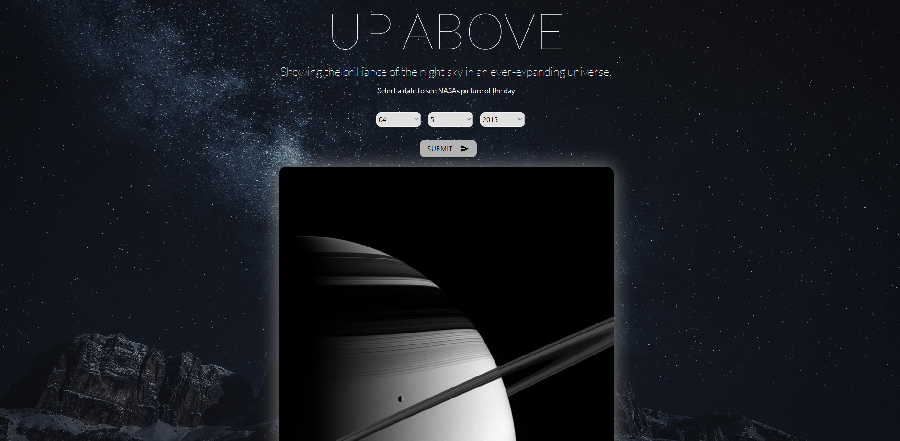

# Up-Above
"Showing the brilliance of the night sky in an ever-expanding universe."

## Site URL
https://drubaloo.github.io/Up-Above/

## What it is
Up Above is a website that aims to inform. It does the following:
- provides the user with the NASA image of the day of the day they choose
- has every image that NASA has featured, from 2015 until present time
- provides basic information and links to more information on: sun, earth, mars, mercury, venus, jupiter, neptune, uranus, saturn, and pluto

## Upcoming features
- lunar phases
- age calculator

## Technologies
HTML
CSS / Parallax
JavaScript
jQuery
Materialize

## APIs
> Solar System Open Data: https://www.programmableweb.com/api/solar-system-opendata
> NASA: APoD: https://apod.nasa.gov/apod/astropix.html

## References
> https://nssdc.gsfc.nasa.gov/planetary/factsheet/

## User story
AS A person with a budding interest in astronomy (with little to no knowledge),
I WANT to find an easy-to-use website that will provide me basic information without too many buttons or confusing UI elements,
SO THAT I can learn useful information that will serve as an introduction to space knowledge.

GIVEN a website with space information,

WHEN I enter a particular date and click submit,
THEN I am shown the NASA image of the day for the day I selected.

WHEN I scroll down past the image of the day,
THEN I am shown each major body in our galaxy, in order from the sun to pluto.

WHEN I click "click for more info" beneath each planet,
THEN an area appears below with more information regarding that planet.

